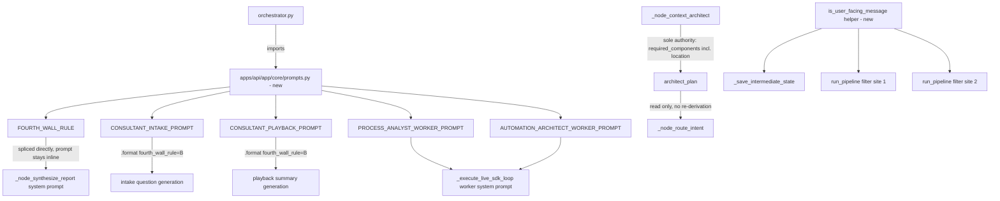

# System Design: Orchestrator Dedup — Fourth Wall Rule, Message Filter, Required-Components, prompts.py (Audit Cycle 5 of 5)

## 1. Architecture Overview

Four independent, sequential edits: create the new `prompts.py` module, wire `orchestrator.py` to import from it (including splicing `FOURTH_WALL_RULE` into the one prompt that stays inline), extract the message-filter predicate into one helper, and delete the now-redundant required-components re-derivation. All four land in `apps/api/app/core/` only; no other part of the codebase is touched.

**Commit granularity note**: per the convention adopted in Cycle 1 (`docs/DEFECT_LEDGER.md` BUG-032), all steps below land in **one final commit**, not one per step. Run each step's targeted verification for fast feedback as you go; only `git commit` once, after Step 5's full verification pass.

## 2. Data Flow

## 3. Atomic Implementation Steps

### Step 1: Create `apps/api/app/core/prompts.py`
- **Read Path**: [`apps/api/app/core/orchestrator.py`](file:///C:/Users/nimel.thomas/Desktop/BuildSense/.claude/worktrees/audit-remediation/apps/api/app/core/orchestrator.py) (lines 337-459)
- **Modify Path**: `apps/api/app/core/prompts.py` (new)
- **Description**: Create the new module with, in order: `FOURTH_WALL_RULE` (one canonical version synthesizing the three current copies' wording, per spec.md 2.1), then `CONSULTANT_INTAKE_PROMPT` (moved from lines 337-405, Fourth Wall block replaced with a `{fourth_wall_rule}` placeholder), `CONSULTANT_PLAYBACK_PROMPT` (moved from lines 406-443, same placeholder substitution), `PROCESS_ANALYST_WORKER_PROMPT` (moved verbatim from lines 446-451), `AUTOMATION_ARCHITECT_WORKER_PROMPT` (moved verbatim from lines 454-459). No import from `orchestrator.py` in this new module (one-directional dependency, per spec.md's non-functional requirements).
- **Targeted verification**: `python -c "from app.core.prompts import FOURTH_WALL_RULE, CONSULTANT_INTAKE_PROMPT, CONSULTANT_PLAYBACK_PROMPT, PROCESS_ANALYST_WORKER_PROMPT, AUTOMATION_ARCHITECT_WORKER_PROMPT; print('ok')"` (from `apps/api`) — confirms the module imports cleanly before wiring anything else to it.

### Step 2: Wire `orchestrator.py` to import from `prompts.py` and splice `FOURTH_WALL_RULE`
- **Read Path**: same file (lines 337-459 for the definitions being removed, ~2196-2207 and ~2286 area for the two `.format()` call sites, ~2561-2564 for the inline synthesis prompt)
- **Modify Path**: `apps/api/app/core/orchestrator.py`
- **Description**:
  - Remove the five now-duplicated constant definitions (lines 337-459) from `orchestrator.py`; add an import from `app.core.prompts` for all five names.
  - Add `fourth_wall_rule=FOURTH_WALL_RULE` to the `CONSULTANT_INTAKE_PROMPT.format(...)` call's keyword arguments.
  - Add `fourth_wall_rule=FOURTH_WALL_RULE` to the `CONSULTANT_PLAYBACK_PROMPT.format(...)` call's keyword arguments.
  - In `_node_synthesize_report`'s inline synthesis system prompt, replace the three hardcoded Fourth Wall Rule lines with an interpolation of `FOURTH_WALL_RULE` (this prompt is built via string concatenation/f-string, so this is a direct substitution, not a `.format()` placeholder).
- **Targeted verification**: `pytest apps/api/tests/test_interview.py -v` (from `apps/api`) — exercises both consultant prompt call sites; `grep -n "THE FOURTH WALL RULE" apps/api/app/core/orchestrator.py apps/api/app/core/prompts.py` should show the canonical text once in `prompts.py` and no hardcoded duplicate blocks remaining in `orchestrator.py`.

### Step 3: Extract `is_user_facing_message` and use it at all three filter sites
- **Read Path**: same file (lines 1526-1528, 3332, 3344)
- **Modify Path**: same file
- **Description**: Add `is_user_facing_message(m: Message) -> bool` as a module-level helper near the other message-coercion helpers (e.g. near `_coerce_message`), implementing exactly the predicate currently duplicated three times (per spec.md 2.3). Replace `_save_intermediate_state`'s imperative `if m.role == "tool": continue` / `if m.role == "assistant" and m.name not in {...}: continue` pair with a single `if not is_user_facing_message(m): continue`. Replace both `run_pipeline` list-comprehension predicates with calls to the same helper.
- **Targeted verification**: `pytest apps/api/tests/test_orchestrator.py apps/api/tests/test_analyst_behavior.py -v` (from `apps/api`) — these are the suites most likely to assert on message filtering/isolation behavior from earlier BUG fixes in this area.

### Step 4: Remove the redundant required-components re-derivation
- **Read Path**: same file (lines 1755-1761 for context, 1874-1876 for the removal)
- **Modify Path**: same file
- **Description**: Delete the `if architect_plan.get("requires_location") and "location" not in required_keys: required_keys.append("location")` block from `_node_route_intent`. Leave the preceding line (`required_keys = list(planned_required) if isinstance(planned_required, list) else [...]`) unchanged — it remains the read path, now sourced exclusively from `_node_context_architect`'s output.
- **Targeted verification**: `pytest apps/api/tests/test_interview.py::test_architect_requires_location_for_physical_shop apps/api/tests/test_ontology.py -v` (from `apps/api`) — the two suites that directly assert on `requires_location`/`required_components` behavior.

### Step 5: Full verification pass and single commit
- **Read Path**: n/a
- **Modify Path**: none
- **Description**: Run the full backend suite, mypy, and both local guardrail scripts. If all pass, stage the new `prompts.py` and the modified `orchestrator.py` (two files — no other file should have changed) and make one commit for the whole cycle, through the normal pre-commit hook (no `--no-verify`).
- **Targeted verification**: `pytest apps/api/tests/ -v`, `mypy app/`, `python scripts/check_phase_gate.py`, `python scripts/sync_agent_rules.py --check`.

---

## 4. Verification Plan

### Automated Tests
- `pytest apps/api/tests/ -v` (from `apps/api`)
- `pytest apps/api/tests/test_interview.py apps/api/tests/test_orchestrator.py apps/api/tests/test_ontology.py apps/api/tests/test_analyst_behavior.py -v` (from `apps/api`)
- `mypy app/` (from `apps/api`)

### Local Guardrail Scripts
- `python scripts/check_phase_gate.py` (repo root)
- `python scripts/sync_agent_rules.py --check` (repo root)

### Manual
- `grep -n "THE FOURTH WALL RULE" apps/api/app/core/orchestrator.py apps/api/app/core/prompts.py` — one canonical copy in `prompts.py`, no hardcoded duplicates left in `orchestrator.py`.
- `git diff --stat` against the pre-cycle commit — confirms only `apps/api/app/core/prompts.py` (new) and `apps/api/app/core/orchestrator.py` (modified) changed.
