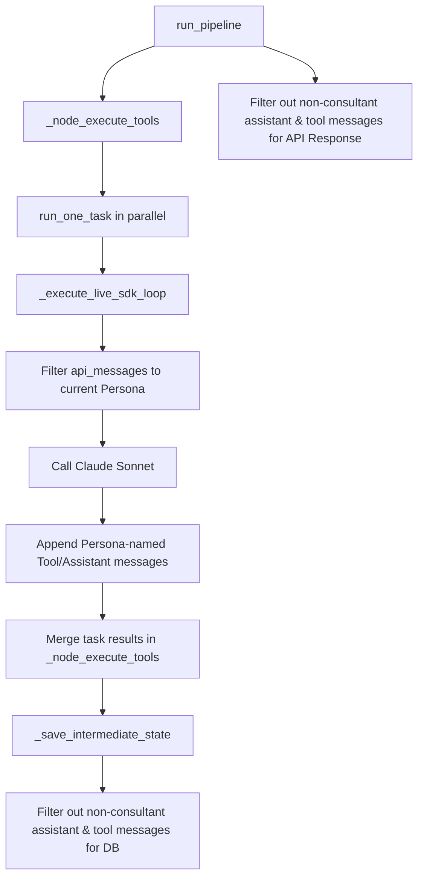

# System Design: Fix Test Hangs, Test Crashes, Filter Worker Messages, and Optimize Tool Latency

## 1. Architecture Overview
The BuildSense backend orchestrator executes parallel worker tasks concurrently using `asyncio.gather`. However, because they write to and read from the same `messages` key in `AgentState`, their conversation contexts pollute each other over multiple execution loops. Additionally, unit tests that verify persistence and tool handlers make live network requests to the Anthropic API and external search endpoints, causing hangs and slow runs.

To fix these issues, we will:
1. **Isolate Worker Persona Message History**: Filter message history inside `_execute_live_sdk_loop` to ensure each worker persona only receives their own private history (along with the common playback history) and never sees other workers' tool calls, tool results, or responses.
2. **Exclude Worker and Tool Messages from User Chat**: Update `_save_intermediate_state` and the final `run_pipeline` response parsing to filter out worker persona messages and tool results, ensuring the user only sees clean conversation turns with the intake consultant (`BuildSense Intelligence`).
3. **Optimize market_signal Tool**: Run HN and Reddit search calls concurrently in a thread pool and reduce timeout to 1.0 second.
4. **Mock Unit Test Network Traffic**: Ensure all unit tests run offline in mock mode.

---

## 2. Data Flow

---

## 3. Atomic Implementation Steps

### Step 1: Isolate Persona Message History
- **Read Path**: [`apps/api/app/core/orchestrator.py`](file:///C:/Users/nimel.thomas/Desktop/BuildSense/apps/api/app/core/orchestrator.py)
- **Modify Path**: [`apps/api/app/core/orchestrator.py`](file:///C:/Users/nimel.thomas/Desktop/BuildSense/apps/api/app/core/orchestrator.py)
- **Description**: Add a filter in `_execute_live_sdk_loop` when building `api_messages` to skip messages where the `name` is not `None` and is not `persona` and is not `"BuildSense Intelligence"`.

### Step 2: Filter Worker and Tool Messages from DB & Response
- **Read Path**: [`apps/api/app/core/orchestrator.py`](file:///C:/Users/nimel.thomas/Desktop/BuildSense/apps/api/app/core/orchestrator.py)
- **Modify Path**: [`apps/api/app/core/orchestrator.py`](file:///C:/Users/nimel.thomas/Desktop/BuildSense/apps/api/app/core/orchestrator.py)
- **Description**: 
  - Update `_save_intermediate_state` to skip assistant messages where `name` is not in `{None, "BuildSense Intelligence"}` and skip tool messages.
  - Update `run_pipeline` to apply the same filter on the returned `SessionState.messages`.

### Step 3: Fix TypeError in Analyst Behavior Test
- **Read Path**: [`apps/api/tests/test_analyst_behavior.py`](file:///C:/Users/nimel.thomas/Desktop/BuildSense/apps/api/tests/test_analyst_behavior.py)
- **Modify Path**: [`apps/api/tests/test_analyst_behavior.py`](file:///C:/Users/nimel.thomas/Desktop/BuildSense/apps/api/tests/test_analyst_behavior.py)
- **Description**: Update the mock `complete_execution_loop` function signature to `async def complete_execution_loop(state_dict: dict, *args: Any, **kwargs: Any) -> None:`.

### Step 4: Fix Hang in Checkpointer Persistence Test
- **Read Path**: [`apps/api/tests/test_langgraph.py`](file:///C:/Users/nimel.thomas/Desktop/BuildSense/apps/api/tests/test_langgraph.py)
- **Modify Path**: [`apps/api/tests/test_langgraph.py`](file:///C:/Users/nimel.thomas/Desktop/BuildSense/apps/api/tests/test_langgraph.py)
- **Description**: Wrap the pipeline runs in `test_langgraph_checkpoint_persistence_and_resumption` with `with patch("app.core.orchestrator.HAS_ANTHROPIC", False):`.

### Step 5: Optimize market_signal Tool Latency & Parallelize Calls
- **Read Path**: [`apps/api/app/mcp/tools.py`](file:///C:/Users/nimel.thomas/Desktop/BuildSense/apps/api/app/mcp/tools.py)
- **Modify Path**: [`apps/api/app/mcp/tools.py`](file:///C:/Users/nimel.thomas/Desktop/BuildSense/apps/api/app/mcp/tools.py)
- **Description**: 
  - Refactor `market_signal_mcp` to fetch HackerNews and Reddit search results concurrently in parallel threads using `concurrent.futures.ThreadPoolExecutor`.
  - Reduce connection/request timeouts for both endpoints from 5.0 seconds to 1.0 second.

### Step 6: Mock Network in market_signal Tool Test
- **Read Path**: [`apps/api/tests/test_mcp_tools.py`](file:///C:/Users/nimel.thomas/Desktop/BuildSense/apps/api/tests/test_mcp_tools.py)
- **Modify Path**: [`apps/api/tests/test_mcp_tools.py`](file:///C:/Users/nimel.thomas/Desktop/BuildSense/apps/api/tests/test_mcp_tools.py)
- **Description**: Update `test_market_signal_mcp_containment` to mock the `httpx.get` calls, ensuring the test run is fully offline.

---

## 4. Verification Plan

### Automated Tests
- Run unit and integration tests:
  `pytest tests/ -v`
- Run specific tests:
  `pytest tests/test_analyst_behavior.py -k test_confirmed_intake_is_required_before_execution -v`
  `pytest tests/test_langgraph.py -v`
  `pytest tests/test_mcp_tools.py -v`
