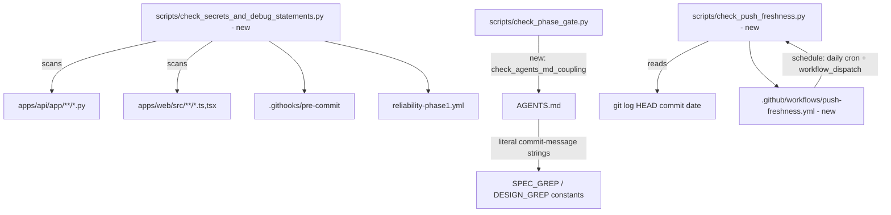

# System Design: Meta-Governance Cycle 1 — Secrets/Debug Lint, AGENTS.md↔Phase-Gate Coupling Check, Push-Freshness Guard

## 1. Architecture Overview

Three independent, additive mechanisms, each following the existing `check_phase_gate.py` pattern (pure stdlib, git-plumbing only, `--staged-files` override for CI): a new secrets/debug-statement scanner, a new coupling check added to the existing phase-gate script, and a new push-freshness scanner wired into its own scheduled workflow. A final step wires the two new scanners into the existing local hook and CI workflow. No application code (`apps/api/app/`, `apps/web/src/`) is touched — this cycle is tooling/CI only, per spec.md's non-functional requirements.

**Commit granularity note**: per the convention adopted in Cycle 1 (`docs/DEFECT_LEDGER.md` BUG-032) and repeated in Cycle 5, all steps below land in **one final commit**, not one per step. Run each step's targeted verification for fast feedback as you go; only `git commit` once, after Step 5's full verification pass.

## 2. Data Flow

## 3. Atomic Implementation Steps

### Step 1: Create `scripts/check_secrets_and_debug_statements.py`
- **Read Path**: `scripts/check_phase_gate.py` (style/pattern reference: `get_staged_files()`, `--staged-files` argparse override, stdlib-only approach)
- **Modify Path**: `scripts/check_secrets_and_debug_statements.py` (new)
- **Description**: Implement per spec.md 2.1 — scope to `^apps/api/app/.*\.py$` and `^apps/web/src/.*\.(ts|tsx)$` only; flag `print(`/`console.log(`, AWS-style keys (`AKIA[0-9A-Z]{16}`), private-key headers, and `(api[_-]?key|secret|token|password)\s*[:=]\s*["'][A-Za-z0-9+/=_-]{16,}["']` (case-insensitive). Print file/line/category per finding to stderr; exit 1 on any finding, exit 0 otherwise.
- **Targeted verification**: `python scripts/check_secrets_and_debug_statements.py` (repo root) against the current tree — expect exit 0. Then create a scratch file outside the repo's tracked paths containing a fake `AKIA` key and a `print(` call, run with `--staged-files <scratch_path>`, confirm exit 1 with both findings reported, then delete the scratch file.

### Step 2: Add `check_agents_md_coupling()` to `check_phase_gate.py`
- **Read Path**: `AGENTS.md` (Phase 1/Phase 2 sections, to locate the exact literal commit command strings), `scripts/check_phase_gate.py` (existing `SPEC_GREP`/`DESIGN_GREP` constants and `main()`'s check list)
- **Modify Path**: `scripts/check_phase_gate.py`
- **Description**: Add a function that reads `AGENTS.md`, extracts the message text from `git commit --no-verify -m "docs: finalize specification"` and `git commit --no-verify -m "docs: finalize system design"`, and asserts each matches `SPEC_GREP`/`DESIGN_GREP` with the `^` anchor stripped. Add it to the `for check in (...)` tuple in `main()` so it runs unconditionally (not gated on staged-file patterns). On mismatch, print both values side by side and exit 1.
- **Targeted verification**: `python scripts/check_phase_gate.py` (repo root) — expect exit 0 (confirms the new check passes against the current, correctly-paired AGENTS.md/script state).

### Step 3: Create `scripts/check_push_freshness.py` and `.github/workflows/push-freshness.yml`
- **Read Path**: `.github/workflows/reliability-phase1.yml` (style reference for workflow structure)
- **Modify Path**: `scripts/check_push_freshness.py` (new), `.github/workflows/push-freshness.yml` (new)
- **Description**: `check_push_freshness.py` is a small pure-Python script exposing a testable `days_since(commit_iso_date: str, now: datetime | None = None) -> int` function and a `main()` that runs `git log -1 --format=%aI` on the currently checked-out HEAD, computes days elapsed, and exits 1 with a clear message if greater than a `--max-days` argument (default 3). The workflow (`schedule:` daily cron + `workflow_dispatch:`) checks out the repo and calls this script with no arguments beyond an optional threshold env var. Keeping the date-diff logic in a plain function (not inlined in YAML/bash) is what makes it testable per spec.md acceptance criterion 3.
- **Targeted verification**: run `python -c "from scripts.check_push_freshness import days_since; from datetime import datetime, timezone; print(days_since('2020-01-01T00:00:00+00:00', datetime(2020,1,10, tzinfo=timezone.utc)))"` (repo root) — expect `9`. Validate the workflow YAML parses: `python -c "import yaml; yaml.safe_load(open('.github/workflows/push-freshness.yml'))"`.

### Step 4: Wire the secrets/debug check into the local hook and CI
- **Read Path**: `.githooks/pre-commit`, `.github/workflows/reliability-phase1.yml`
- **Modify Path**: `.githooks/pre-commit`, `.github/workflows/reliability-phase1.yml`
- **Description**: In `.githooks/pre-commit`, add `python scripts/check_secrets_and_debug_statements.py || exit 1` alongside the existing `check_phase_gate.py`/`sync_agent_rules.py --check` calls, before the pytest step. In `reliability-phase1.yml`, add a step after the existing "Run phase-gate check" step that runs `python scripts/check_secrets_and_debug_statements.py --staged-files $CHANGED`, reusing the `$CHANGED` variable already computed there.
- **Targeted verification**: `sh .githooks/pre-commit` (repo root, dry run) — confirm the new check executes and exits 0 before pytest runs. Visual review of the workflow diff for correct step placement (no live CI run possible from local verification).

### Step 5: Full verification pass and single commit
- **Read Path**: n/a
- **Modify Path**: none
- **Description**: Run the full backend suite, mypy, and all four local guardrail scripts (`check_phase_gate.py`, `sync_agent_rules.py --check`, `check_secrets_and_debug_statements.py`, `check_push_freshness.py` in dry-run/importable-function mode). If all pass, stage the five new/modified files (two new scripts, one new workflow, `.githooks/pre-commit`, `reliability-phase1.yml`) and make one commit for the whole cycle, through the normal pre-commit hook (no `--no-verify`).
- **Targeted verification**: `pytest apps/api/tests/ -v`, `mypy app/`, `python scripts/check_phase_gate.py`, `python scripts/sync_agent_rules.py --check`, `python scripts/check_secrets_and_debug_statements.py`.

---

## 4. Verification Plan

### Automated / Local Guardrail Scripts
- `pytest apps/api/tests/ -v` (from `apps/api`) — confirms zero regression, since no application code is touched.
- `mypy app/` (from `apps/api`)
- `python scripts/check_phase_gate.py` (repo root) — now includes the new coupling check.
- `python scripts/sync_agent_rules.py --check` (repo root)
- `python scripts/check_secrets_and_debug_statements.py` (repo root)

### Manual
- Fixture test for the secrets/debug scanner (Step 1), discarded after use.
- Temporary one-character edit to a scratch copy of AGENTS.md's commit-message string to confirm `check_agents_md_coupling()` actually fails on drift, then revert (never commit the broken copy).
- `git diff --stat` against the pre-cycle commit — confirms only the five files named in Step 5 changed.
