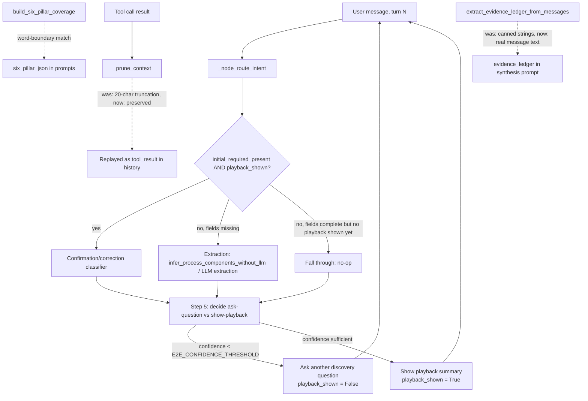

# System Design: Orchestrator Hallucination and Confirmation-Gate Fixes (Audit Cycle 2 of 5)

## 1. Architecture Overview

All seven fixes in this cycle live inside `apps/api/app/core/orchestrator.py` (plus one supporting field in `apps/api/app/models/state.py` and two test-fixture updates), touching independent functions that don't call each other, so they can be implemented and verified as separate, focused edits within one working session. They fall into three groups:

- **Prompt/matching hygiene** (2.1, 2.2, 2.3): word-boundary matching for six-pillar keywords, removing a named brand from a negative prompt instruction, and un-truncating tool output — all reduce the chance of the model stating something the user never said.
- **Confirmation-routing correctness** (2.4, 2.5): a new `playback_shown` state field closes the gap where a user could be asked to confirm a summary they were never shown, plus fixing two substring-matching bugs that can misread a correction as a confirmation.
- **Deterministic fabrication removal** (2.6, 2.7): two code paths that emit fixed, made-up text regardless of input, replaced with content grounded in what the user actually said.

**Commit granularity note**: per the convention adopted in Cycle 1 (`docs/DEFECT_LEDGER.md` BUG-032), `check_phase_gate.py` allows exactly one source-touching commit per spec+design checkpoint pair. All steps below land in **one final commit** at the end of Phase 3, not one commit per step. Run each step's targeted verification command for fast feedback as you go, but only invoke `git commit` once, after Step 8's full verification pass.

## 2. Data Flow

## 3. Atomic Implementation Steps

### Step 1: Word-boundary matching for six-pillar keyword coverage
- **Read Path**: [`apps/api/app/core/orchestrator.py`](file:///C:/Users/nimel.thomas/Desktop/BuildSense/.claude/worktrees/audit-remediation/apps/api/app/core/orchestrator.py) (lines 474-511, 923-927)
- **Modify Path**: same file, `build_six_pillar_coverage` (lines 923-927 area)
- **Description**: Replace `if keyword in combined_text:` with a word-boundary regex match (`re.search(rf"\b{re.escape(keyword)}\b", combined_text)`). No change to `SIX_PILLARS` keyword lists themselves.
- **Targeted verification**: `pytest apps/api/tests/test_ontology.py -v` (covers architect/pillar behavior), plus a quick manual check: `python -c "..."` confirming `build_six_pillar_coverage("we are totally overwhelmed", {}, {})["technology"]["status"] == "missing"`.

### Step 2: Remove the named brand from the intake prompt's negative instruction
- **Read Path**: same file, `CONSULTANT_INTAKE_PROMPT` (line 387)
- **Modify Path**: same file, line 387
- **Description**: Replace the specific brand list with a generic instruction that names no software/brand, per spec.md 2.2.
- **Targeted verification**: `grep -n "Tally" apps/api/app/core/orchestrator.py` returns no matches outside of any test fixtures that legitimately reference the word in an unrelated context (verify none do).

### Step 3: Stop destructively truncating tool output
- **Read Path**: same file, `_prune_context` (lines 2811-2814) and its two call sites (3182, 3243)
- **Modify Path**: same file, `_prune_context` only
- **Description**: Remove the `raw_content[:20]` truncation; preserve tool output up to a much larger cap (a few thousand characters) rather than ~20. No call-site changes needed.
- **Targeted verification**: `pytest apps/api/tests/test_mcp_tools.py apps/api/tests/test_orchestrator.py -v`

### Step 4: Add `playback_shown` and gate the confirmation classifier on it
- **Read Path**: [`apps/api/app/models/state.py`](file:///C:/Users/nimel.thomas/Desktop/BuildSense/.claude/worktrees/audit-remediation/apps/api/app/models/state.py) (line 113 area), [`apps/api/app/core/orchestrator.py`](file:///C:/Users/nimel.thomas/Desktop/BuildSense/.claude/worktrees/audit-remediation/apps/api/app/core/orchestrator.py) (lines 79-104, 1847, 1880, 2154, ~2229-2242, ~2301-2314)
- **Modify Path**: both files above
- **Description**:
  - `state.py`: add `playback_shown: bool = Field(default=False, description="Whether a playback summary was shown to the user on the most recent non-confirmed turn.")` immediately after the existing `playback_confirmed` field.
  - `orchestrator.py`: add `playback_shown: bool` to the `AgentState` TypedDict (mirroring `playback_confirmed`); read it alongside `playback_confirmed` near line 1847; change the branch at line 1880 to the three-way `if initial_required_present and playback_shown: / elif not initial_required_present: / else: pass` structure described in spec.md 2.4; set `"playback_shown": False` in the ask-question branch's `updates` dict and `"playback_shown": True` in the show-playback branch's `updates` dict; replace the literal `0.85` at line 2154 with `E2E_CONFIDENCE_THRESHOLD`.
- **Targeted verification**: `pytest apps/api/tests/test_interview.py apps/api/tests/test_orchestrator.py apps/api/tests/test_analyst_behavior.py -v`

### Step 5: Fix substring-based confirmation misclassification
- **Read Path**: same orchestrator.py (lines 536, 544, 1963, 1965)
- **Modify Path**: same file, both sites
- **Description**: Replace substring `in` checks with whole-word tokenized matching at both `classify_answer_quality`'s `confirmation_markers` check and `_node_route_intent`'s two ad hoc fallback checks, per spec.md 2.5. Leave `check_deterministic_confirmation` untouched.
- **Targeted verification**: a small standalone check (e.g. via `python -c` or a new/existing test) confirming `classify_answer_quality("That's incorrect", {})` does not return `"confirmation"`, and that the `_node_route_intent` fallback path (exercisable via existing mocked-no-API-key tests in `test_interview.py`) does not treat `"incorrect"` as a confirmation. Run `pytest apps/api/tests/test_interview.py -v`.

### Step 6: Stop fabricating evidence-ledger claims
- **Read Path**: same orchestrator.py (lines 215-267), [`apps/api/tests/test_ontology.py`](file:///C:/Users/nimel.thomas/Desktop/BuildSense/.claude/worktrees/audit-remediation/apps/api/tests/test_ontology.py) (lines 26-52)
- **Modify Path**: `orchestrator.py` (required); `test_ontology.py` only if its existing assertions fail after the change
- **Description**: Replace each hardcoded `claim` string in `extract_evidence_ledger_from_messages` with the actual message content, per spec.md 2.6. Keep the `ladder_level`/`source` categorization logic as-is.
- **Targeted verification**: `pytest apps/api/tests/test_ontology.py -v`. If `test_evidence_ladder_extraction` fails, inspect why before editing it — its example messages were written to contain the same substrings as the old canned strings, so it is expected to keep passing unmodified.

### Step 7: Genericize the hardcoded example email
- **Read Path**: same orchestrator.py (line 1262), [`apps/api/tests/evals/eval_dataset.py`](file:///C:/Users/nimel.thomas/Desktop/BuildSense/.claude/worktrees/audit-remediation/apps/api/tests/evals/eval_dataset.py) (line 336)
- **Modify Path**: both files
- **Description**: Replace `contracts@starlight.com` with `contracts@yourcompany.com` in `orchestrator.py`; update the matching literal in `eval_dataset.py`'s `expected_report_contains` list.
- **Targeted verification**: `grep -rn "starlight" apps/api/` returns no matches.

### Step 8: Full verification pass and single commit
- **Read Path**: n/a
- **Modify Path**: none
- **Description**: Run the full backend suite and both local guardrail scripts. If all pass, stage every file touched in Steps 1-7 (`orchestrator.py`, `state.py`, `test_ontology.py` if changed, `eval_dataset.py`) and make one commit for the whole cycle, through the normal pre-commit hook (no `--no-verify`).
- **Targeted verification**: `pytest apps/api/tests/ -v`, `python scripts/check_phase_gate.py`, `python scripts/sync_agent_rules.py --check`.

---

## 4. Verification Plan

### Automated Tests
- `pytest apps/api/tests/ -v` (from `apps/api`)
- `pytest apps/api/tests/test_ontology.py -v`
- `pytest apps/api/tests/test_orchestrator.py apps/api/tests/test_interview.py apps/api/tests/test_analyst_behavior.py -v`
- `pytest apps/api/tests/test_mcp_tools.py -v`

### Local Guardrail Scripts
- `python scripts/check_phase_gate.py` (repo root)
- `python scripts/sync_agent_rules.py --check` (repo root)

### Manual
- `grep -n "Tally" apps/api/app/core/orchestrator.py` — no matches
- `grep -rn "starlight" apps/api/` — no matches
