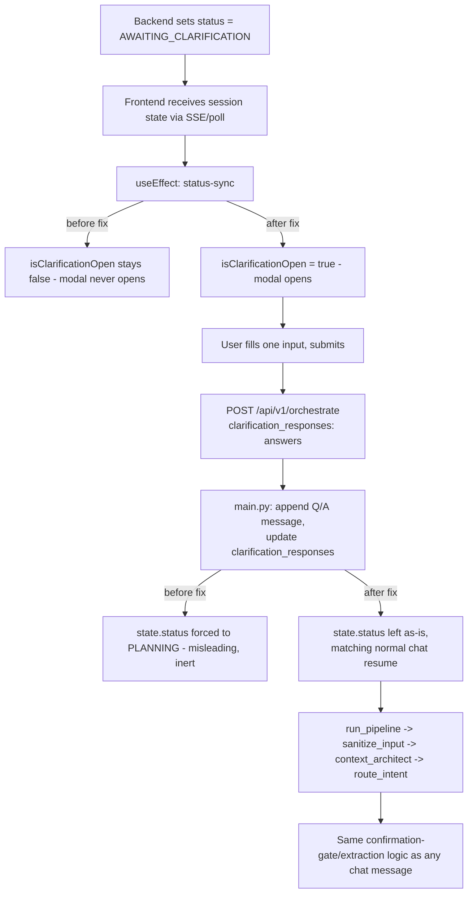

# System Design: Restore the Human-in-the-Loop Clarification Modal (Audit Cycle 3 of 5)

## 1. Architecture Overview

Two independent, single-line-scale edits, one frontend and one backend, neither of which depends on the other to be individually correct — but both are needed for the feature to work cleanly end-to-end (the frontend fix makes the modal reachable; the backend fix removes a misleading line encountered while verifying the modal's submit path is safe).

- **Frontend**: `apps/web/src/app/[lang]/projects/[id]/page.tsx`'s status-sync `useEffect` currently sets `isClarificationOpen` to `false` in both branches of its `AWAITING_CLARIFICATION` check. Fix the `AWAITING_CLARIFICATION` branch to set it `true`.
- **Backend**: `apps/api/app/main.py`'s `clarification_responses` handling block sets `state.status = SessionStatus.PLANNING`, which — per the Cycle 3 spec's investigation — has no functional effect on graph routing (the entry point is always `sanitize_input`, and `_node_route_intent` never reads incoming status). Remove that line so the code doesn't misleadingly imply a status jump that doesn't occur.

## 2. Data Flow

## 3. Atomic Implementation Steps

### Step 1: Fix the modal open/close toggle
- **Read Path**: [`apps/web/src/app/[lang]/projects/[id]/page.tsx`](file:///C:/Users/nimel.thomas/Desktop/BuildSense/.claude/worktrees/audit-remediation/apps/web/src/app/%5Blang%5D/projects/%5Bid%5D/page.tsx) (lines 191-198)
- **Modify Path**: same file, line 195
- **Description**: Change `setIsClarificationOpen(false);` (the one inside the `AWAITING_CLARIFICATION` branch, currently line 195) to `setIsClarificationOpen(true);`. Leave line 197 (the `else` branch's `setIsClarificationOpen(false);`) unchanged.
- **Targeted verification**: `npm run type-check` and `npm run lint` (from `apps/web`); manual visual check per spec.md 5.

### Step 2: Remove the misleading forced-PLANNING status line
- **Read Path**: [`apps/api/app/main.py`](file:///C:/Users/nimel.thomas/Desktop/BuildSense/.claude/worktrees/audit-remediation/apps/api/app/main.py) (lines 476-493)
- **Modify Path**: same file, line 492
- **Description**: Delete the `state.status = SessionStatus.PLANNING` line. Verify no other code in this function or its callers relies on `state.status` being `PLANNING` specifically at this point (grep `SessionStatus.PLANNING` in `main.py` and `orchestrator.py` to confirm nothing downstream branches on it before `run_pipeline` re-derives status).
- **Targeted verification**: `pytest apps/api/tests/ -v` (from `apps/api`) — confirms no existing test asserted the old forced-PLANNING behavior; if one does, inspect it per the same "verify, don't assume" approach used in Cycle 2 before changing it.

### Step 3: Full verification pass and single commit
- **Read Path**: n/a
- **Modify Path**: none
- **Description**: Run the full backend suite, frontend type-check/lint, and both local guardrail scripts. If all pass, stage the two changed files (`page.tsx`, `main.py`) and make one commit for this cycle, through the normal pre-commit hook (no `--no-verify`).
- **Targeted verification**: `pytest apps/api/tests/ -v`, `npm run type-check`, `npm run lint`, `python scripts/check_phase_gate.py`, `python scripts/sync_agent_rules.py --check`.

---

## 4. Verification Plan

### Automated
- `pytest apps/api/tests/ -v` (from `apps/api`)
- `npm run type-check` (from `apps/web`)
- `npm run lint` (from `apps/web`)

### Local Guardrail Scripts
- `python scripts/check_phase_gate.py` (repo root)
- `python scripts/sync_agent_rules.py --check` (repo root)

### Manual
- `grep -n "SessionStatus.PLANNING" apps/api/app/main.py apps/api/app/core/orchestrator.py` — confirm no other code path depends on the removed line's side effect.
- Visual check of the modal opening/closing per spec.md 5, if a local dev server is available in this environment; otherwise note in the final report that this step was skipped and why.
